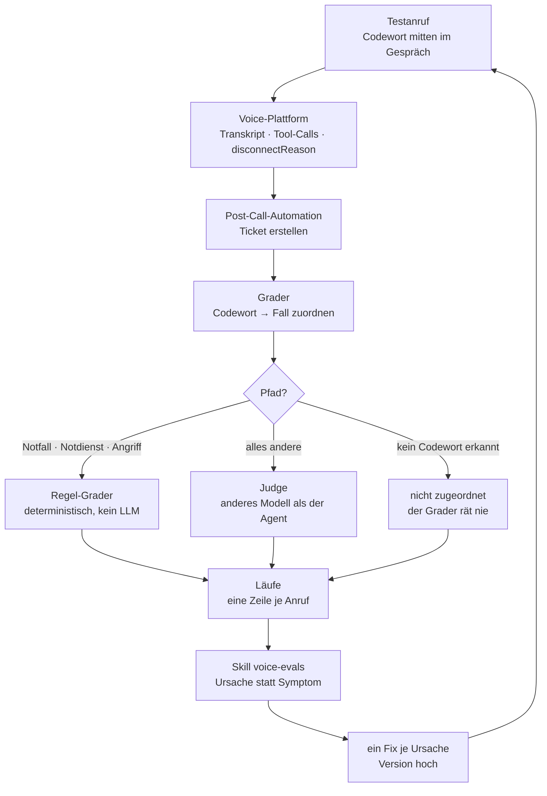

# voice-evals

**88 % aller KI-Piloten erreichen nie den Produktivbetrieb** — auf 33 gestartete Proof-of-Concepts kommen vier, die live gehen ([IDC/Lenovo, März 2025](https://www.cio.com/article/3850763/88-of-ai-pilots-fail-to-reach-production-but-thats-not-all-on-it.html)). Die Bruchstellen sind nicht die Modelle, sondern Evaluation, Governance und Integration.

Bei einem Voice-Agent am Telefon ist die Lücke größer als bei Text: Hintergrundgeräusche, Dialekte, Latenz, und ein Anrufer, der keinen zweiten Versuch bekommt. Ohne Messung ist jede Promptänderung eine Vermutung.

Dieses Repo ist der Messaufbau, mit dem ich das mache — Methode, Grader, Tabellenvorlage und der Claude-Code-Skill, der die Auswertung fährt.

## Wie es läuft



Haftungspfade gehen nie an ein LLM. Ein falsches „bestanden" wäre dort ein Haftungsfall, kein Messfehler.

## Was drin liegt

| Datei | Was |
| --- | --- |
| [versuchsaufbau.md](versuchsaufbau.md) | Messgegenstand, Instrument, Kontrollen, Metriken, Ablauf — und die Grenzen |
| [eval-grader.json](eval-grader.json) | Der Grader als n8n-Workflow, importierbar |
| [skills/voice-evals/](skills/voice-evals/) | Der Claude-Code-Skill: Fälle schreiben, Runde auswerten |
| [Tabellenvorlage](https://docs.google.com/spreadsheets/d/19SLbwL9aN61PI7MN0dhFoHuvjAXGuYoy4i9WfgAsJXg/edit?usp=sharing) | Fälle, Läufe und die Auswertung, die sich selbst rechnet (Google Sheets) |

Der Skill besteht aus `SKILL.md` und zwei Referenzen: [regeln.md](skills/voice-evals/references/regeln.md) (Prüfliste für Voice-Prompts und die Ursachenanalyse) und [template.md](skills/voice-evals/references/template.md) (Blockgerüst für einen Systemprompt). Beide gehören fest dazu und wandern beim Installieren mit.

## Benutzen

**Den Skill installieren** — er liegt in `skills/voice-evals/` und gehört nach `~/.claude/skills/`:

```bash
git clone https://github.com/aalbeek-ai/voice-evals.git
cp -r voice-evals/skills/voice-evals ~/.claude/skills/
```

Danach greift er in Claude Code von selbst, sobald es um Eval-Fälle, eine Eval-Runde oder ein Call-Transkript geht. Wer Claude Code lieber das Repo nennt, kann es auch installieren lassen — der Skill liegt an der üblichen Stelle.

**Die Tabelle** über **[Vorlage kopieren](https://docs.google.com/spreadsheets/d/19SLbwL9aN61PI7MN0dhFoHuvjAXGuYoy4i9WfgAsJXg/copy)** ins eigene Drive holen. Fünf Tabs: `01-Setup` trägt alle Kundenwerte, `02-Systemtests` prüft vor dem ersten Lauf die Leitung, `03-Fälle` und `04-Läufe` sind die beiden Datentabellen, `05-Auswertung` rechnet die vier Quoten von selbst und wird nicht angefasst. In `03-Fälle` stehen ein Beispielfall und sein Zwilling — die zeigen die Konvention und werden überschrieben.

Eine Kopie behält die Tab-IDs: `03-Fälle` ist `gid=0`, `04-Läufe` ist `gid=932118030`. Beide gehen so in den Grader.

**Den Grader** in n8n importieren, dann drei Dinge setzen: die beiden `PLATZHALTER_SPREADSHEET_ID` in `load-case` und `write-run`, die `PLATZHALTER_GID` des Läufe-Tabs, und die Credentials für Google Sheets und Anthropic. Die Werte je Kunde stehen ausschließlich im Node `config`. Der Webhook nimmt den Post-Call-Payload der Telefonie-Plattform entgegen; die Weiche dorthin wird *hinter* die Ticket-Erstellung gehängt.

## Stand

Der Aufbau läuft gegen einen echten Voice-Agent für eine Hausverwaltung. Gemessene Zahlen folgen, sobald eine Version durch das Gate ist — bis dahin steht hier die Methode, nicht das Ergebnis.

Gebaut auf einer Telefonie-Plattform mit Post-Call-Webhook, n8n und Google Sheets. Die Mechanik hängt an keinem davon: was zählt, sind Codewort-Zuordnung, pfadabhängige Bewertung und `pass^k`.

## Feedback

Das ist ausdrücklich erwünscht — besonders von Leuten, die selbst Voice-Agents in Produktion haben.

- Fachlich, mit Beleg: [Issue aufmachen](https://github.com/aalbeek-ai/voice-evals/issues)
- Alles andere: **lasse@aalbeek.de**

Wo etwas nicht belegt ist, steht es als Annahme da. Wenn eine Zahl oder eine Regel hier falsch ist, will ich das wissen.

## Lizenz

[MIT](LICENSE) — nutzen, ändern, weitergeben.

---

*A measurement rig for German-language telephone voice agents: an n8n grader that routes liability paths to deterministic checks and everything else to an LLM judge, a `pass^k` scoring model, a spreadsheet template, and a Claude Code skill that turns failed runs into single root-cause fixes. Method and grader are language-agnostic; the prose is German.*
