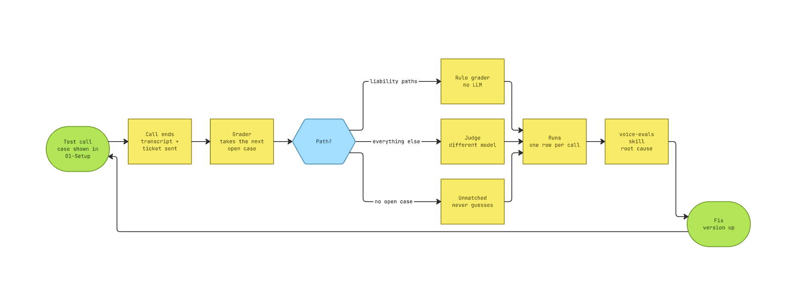

# voice-evals

The best AI agents complete only **30% of realistic professional tasks** fully autonomously (<a href="https://arxiv.org/abs/2412.14161" target="_blank" rel="noopener noreferrer">TheAgentCompany, Xu et al. 2024, Carnegie Mellon University, arXiv:2412.14161</a>). The breakage isn't the models — it's evaluation, governance, and integration.

For a voice agent on the phone the gap is wider than with text: background noise, dialects, latency, and a caller who doesn't get a second try. Without measurement, every prompt change is a guess.

This repo is the eval harness I use for that — method, grader, spreadsheet template, and the Claude Code skill that runs the scoring.

## How it works

A test call carries a codeword. The grader matches it to a case, scores the call by path — liability paths through fixed rules, everything else through a judge model — and writes one row per call. The skill reads the failed rows, finds the root cause, and ships one fix per cause.



Liability paths (emergency, dispatch, attack) never go to an LLM. A false "pass" there would be a liability incident, not a measurement error.

## What's inside

| File | What |
| --- | --- |
| [experimental-setup.md](experimental-setup.md) | Measurement object, instrument, controls, metrics, procedure — and the limits |
| [eval-grader.json](eval-grader.json) | The grader as an n8n workflow, importable |
| [skills/voice-evals/](skills/voice-evals/) | The Claude Code skill: write cases, score a round |
| <a href="https://docs.google.com/spreadsheets/d/19SLbwL9aN61PI7MN0dhFoHuvjAXGuYoy4i9WfgAsJXg/edit?usp=sharing" target="_blank" rel="noopener noreferrer">Spreadsheet template</a> | Cases, runs, and the scoring that computes itself (Google Sheets) |

The skill is `SKILL.md` plus two references: [rules.md](skills/voice-evals/references/rules.md) (checklist for voice agent systems and root-cause analysis) and [template.md](skills/voice-evals/references/template.md) (block scaffold for a system prompt). Both belong to it and travel with it on install.

## Using it

**Install the skill** — it lives in `skills/voice-evals/` and belongs under `~/.claude/skills/`:

```bash
git clone https://github.com/aalbeek-ai/voice-evals.git
cp -r voice-evals/skills/voice-evals ~/.claude/skills/
```

After that it triggers on its own in Claude Code whenever eval cases, an eval round, or a call transcript come up. If you'd rather point Claude Code at the repo, that works too — the skill sits in the usual place.

**The spreadsheet**: get your own copy via **<a href="https://docs.google.com/spreadsheets/d/19SLbwL9aN61PI7MN0dhFoHuvjAXGuYoy4i9WfgAsJXg/copy" target="_blank" rel="noopener noreferrer">copy template</a>**. Five tabs: `01-Setup` holds every customer value, `02-Systemtests` tests the full chain end to end before the first real run — delivery, routing, grader matching, not agent behavior — `03-Fälle` and `04-Läufe` are the two data tables, `05-Auswertung` computes the four rates itself and stays untouched. `03-Fälle` ships with one example case and its twin — they show the convention and get overwritten.

Google Sheets keeps a tab's `gid` when you make a copy, so the grader's placeholders below can hardcode it: `03-Fälle` is `gid=0`, `04-Läufe` is `gid=932118030`. Skip looking these up yourself — reuse them as-is when you set the grader's `PLATZHALTER_GID`.

**The grader**: import it into n8n, then set three things — the two `PLATZHALTER_SPREADSHEET_ID` placeholders in `load-case` and `write-run`, the `PLATZHALTER_GID` of the runs tab, and the credentials for Google Sheets and Anthropic. Per-customer values live exclusively in the `config` node. The webhook takes the post-call payload from the telephony platform; the routing to it hangs *after* ticket creation.

## Status

The harness runs against a real voice agent for a property management company, working through the baseline round now.

Built on <a href="https://fonio.ai" target="_blank" rel="noopener noreferrer">fonio</a>, a post-call webhook, n8n, and Google Sheets. The mechanics don't depend on any of them: what counts is codeword matching, path-dependent scoring, and `pass^k`.

## What's next

**What changes in v2?**

- Measured pass rate and Δ per round, published once a version clears the gate.
- The grader moves from n8n to a plain Python script — one dependency less, easier to audit.
- The remaining German-only pieces (spreadsheet columns, path names, case codewords) get translated, so the whole repo runs in one language.

## Feedback

Explicitly wanted — especially from people who run voice agents in production themselves.

- Technical, with evidence: <a href="https://github.com/aalbeek-ai/voice-evals/issues" target="_blank" rel="noopener noreferrer">open an issue</a>
- Anything else: **lasse@aalbeek.de**

Where something isn't backed by evidence, it's marked as an assumption. If a number or a rule here is wrong, I want to know.

## License

[MIT](LICENSE) — use, change, redistribute.
