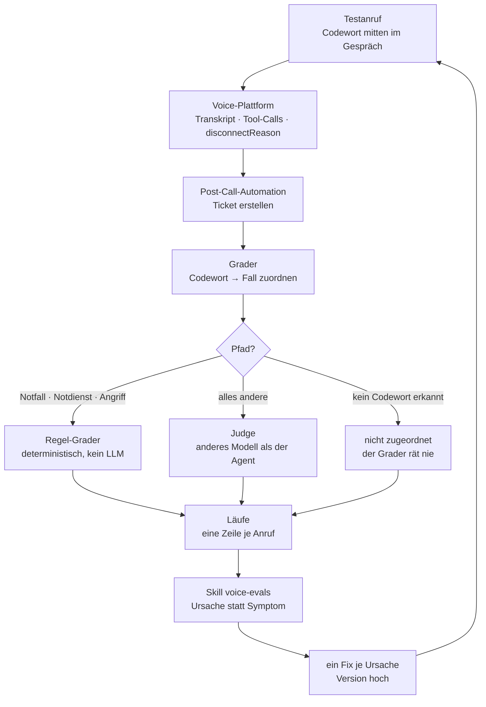

# voice-evals

**88 % aller KI-Piloten erreichen nie den Produktivbetrieb** — auf 33 gestartete Proof-of-Concepts kommen vier, die live gehen ([IDC/Lenovo, März 2025](https://www.cio.com/article/3850763/88-of-ai-pilots-fail-to-reach-production-but-thats-not-all-on-it.html)). Die Bruchstellen sind nicht die Modelle, sondern Evaluation, Governance und Integration.

Bei einem Voice-Agent am Telefon ist die Lücke größer als bei Text: Hintergrundgeräusche, Dialekte, Latenz, und ein Anrufer, der keinen zweiten Versuch bekommt. Wer die Qualität eines solchen Agenten nicht misst, ist jede Promptänderung eine Vermutung.

Dieses Repo ist der Messaufbau, mit dem ich das mache — Methode, Grader und der Claude-Code-Skill, der die Auswertung fährt.

## Wie es läuft



Haftungspfade gehen nie an ein LLM. Ein falsches „bestanden" wäre dort ein Haftungsfall, kein Messfehler.

## Was drin liegt

| Datei | Was |
| --- | --- |
| [versuchsaufbau.md](versuchsaufbau.md) | Messgegenstand, Instrument, Kontrollen, Metriken, Ablauf — und die Grenzen |
| [eval-grader.json](eval-grader.json) | Der Grader als n8n-Workflow, importierbar |
| [SKILL.md](SKILL.md) | Der Claude-Code-Skill: Fälle schreiben, Runde auswerten |
| [references/regeln.md](references/regeln.md) | Prüfliste für Voice-Prompts und die Ursachenanalyse dahinter |
| [references/template.md](references/template.md) | Blockgerüst für einen Voice-Agent-Systemprompt |

## Benutzen

Der Skill — das Repo *ist* das Skill-Verzeichnis:

```bash
git clone https://github.com/aalbeek-ai/voice-evals.git ~/.claude/skills/voice-evals
```

Danach greift er in Claude Code von selbst, sobald es um Eval-Fälle, eine Eval-Runde oder ein Call-Transkript geht.

Den Grader in n8n importieren, dann drei Dinge setzen: die beiden `PLATZHALTER_SPREADSHEET_ID` in `load-case` und `write-run`, die `PLATZHALTER_GID` des Läufe-Tabs, und die Credentials für Google Sheets und Anthropic. Die Werte je Kunde stehen ausschließlich im Node `config`. Der Webhook nimmt den Post-Call-Payload der Telefonie-Plattform entgegen und wird *hinter* die Ticket-Erstellung gehängt.

Die Tabellenvorlage ist im Aufbau — bis dahin steht das Schema in [versuchsaufbau.md](versuchsaufbau.md#datenschema).

## Stand

Der Aufbau läuft gegen einen echten Voice-Agent für eine Hausverwaltung. Gemessene Zahlen folgen, sobald eine Version durch das Gate ist — bis dahin steht hier die Methode, nicht das Ergebnis.

Gebaut auf einer Telefonie-Plattform mit Post-Call-Webhook, n8n und Google Sheets. Die Mechanik hängt an keinem davon: was zählt, sind Codewort-Zuordnung, Pfad-abhängige Bewertung und `pass^k`.

## Feedback

Das ist ausdrücklich erwünscht — besonders von Leuten, die selbst Voice-Agents in Produktion haben.

- Fachlich, mit Beleg: [Issue aufmachen](https://github.com/aalbeek-ai/voice-evals/issues)
- Alles andere: **kresse@aalbeek.de**

Wo etwas nicht belegt ist, steht es als Annahme da. Wenn eine Zahl oder eine Regel hier falsch ist, will ich das wissen.

## Lizenz

[MIT](LICENSE) — nutzen, ändern, weitergeben.

---

*A measurement rig for German-language telephone voice agents: an n8n grader that routes liability paths to deterministic checks and everything else to an LLM judge, a `pass^k` scoring model, and a Claude Code skill that turns failed runs into single root-cause fixes. Method and grader are in English-readable code; the prose is German.*
