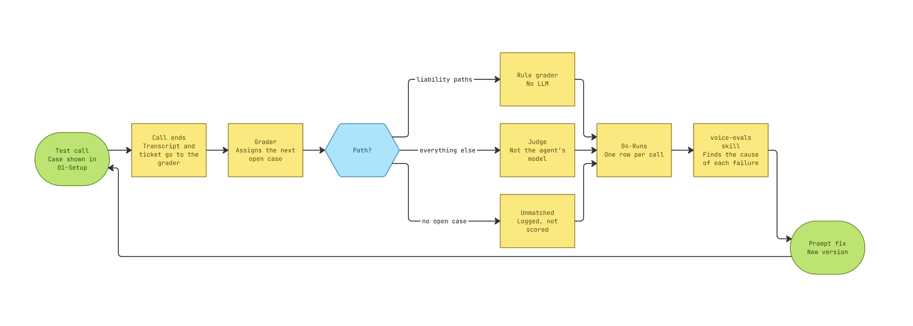

# voice-evals

**88% of AI pilots never reach production** — for every 33 proof-of-concepts started, four go live (<a href="https://www.cio.com/article/3850763/88-of-ai-pilots-fail-to-reach-production-but-thats-not-all-on-it.html" target="_blank" rel="noopener noreferrer">IDC/Lenovo, March 2025</a>). The breakage isn't the models — it's evaluation, governance, and integration.

For a voice agent the gap is wider than with text: background noise, dialects, latency, and one attempt per call with no retry. Without measurement, every prompt change is a guess.

This repo is the eval harness I use for that — method, grader, spreadsheet template, and the Claude Code skill that writes cases and turns a graded round's failures into a fix at the root cause.

## How it works

The spreadsheet shows which case to call next. The grader assigns the call to that case, scores it by path — liability paths by fixed rules, everything else by a judge model — and writes one row per call. The skill reads the round, traces each failure to its cause, and writes one fix per cause.



Liability paths (emergency, dispatch, attack) never go to an LLM. A false "pass" there would be a liability incident, not a measurement error.

## What's inside

| File | What |
| --- | --- |
| [experimental-setup.md](experimental-setup.md) | What's measured, instrument, controls, metrics, procedure, limits |
| [eval-grader.json](eval-grader.json) | The grader as an importable n8n workflow |
| [skills/voice-evals/](skills/voice-evals/) | The Claude Code skill: write cases, root-cause a graded round into one fix per cause |
| [rules.md](skills/voice-evals/references/rules.md) | Skill reference: prompt checklist and root-cause analysis |
| [template.md](skills/voice-evals/references/template.md) | Skill reference: system prompt scaffold |
| <a href="https://docs.google.com/spreadsheets/d/19SLbwL9aN61PI7MN0dhFoHuvjAXGuYoy4i9WfgAsJXg/edit?usp=sharing" target="_blank" rel="noopener noreferrer">Spreadsheet template</a> | Cases, runs, and a results tab that updates automatically (Google Sheets) |

## Using it

1. **Skill.** Install it, and it triggers in Claude Code whenever eval cases, a round, or a call transcript come up:

   ```bash
   git clone https://github.com/aalbeek-ai/voice-evals.git
   cp -r voice-evals/skills/voice-evals ~/.claude/skills/
   ```

2. **Spreadsheet.** <a href="https://docs.google.com/spreadsheets/d/19SLbwL9aN61PI7MN0dhFoHuvjAXGuYoy4i9WfgAsJXg/copy" target="_blank" rel="noopener noreferrer">Copy the template</a> and fill in the `Value` column of `01-Setup`; the `Note` column says who reads each value. The example rows in `02-System tests` and `03-Cases` show the format — overwrite them. `04-Runs` is written by the grader, `05-Results` updates automatically.

3. **Grader.** Import [eval-grader.json](eval-grader.json) into n8n. In `load-setup`, `load-cases`, and `write-run`, replace `YOUR_SPREADSHEET_ID` with your copy's ID (the part of its URL between `/d/` and `/edit`). Add three credentials: Google Sheets, Anthropic, and header auth on `call-details` (any header name and secret). The judge runs on Claude Sonnet 5 — if your agent does too, pick another model in `judge`. Activate the workflow.

4. **Post-call workflow.** For test numbers only, and after the ticket is created, POST the call to the `call-details` webhook with the same header. Only `transcript` is required, as text with one `role: text` line per turn or as a list of `{role, content}`. Transfers go in as `tool` turns. The rest sharpens the grading:

   ```json
   {
     "transcript": "agent: Hello, ...\nuser: ...\ntool: [Transfer] ... succeeded!",
     "ticket": { "request": "...", "callerNumber": "..." },
     "disconnectReason": "call_transfer",
     "duration": 94
   }
   ```

5. **Call.** `01-Setup` shows the next case and what to say. Call, hang up, and the row appears in `04-Runs`. After a round, ask Claude Code to score it.

For the skill to read the spreadsheet itself, Claude Code needs a Google Sheets MCP server, and its Google Cloud project must be enrolled in the Workspace Developer Preview Program — otherwise it authenticates but returns no data. Without one, paste the runs into the chat.

## Status

The harness runs against a real voice agent for a property management company. v2 is in its first round: calls are matched to cases through a queue in the spreadsheet instead of a spoken codeword, and every customer value lives in `01-Setup`.

Built on <a href="https://fonio.ai" target="_blank" rel="noopener noreferrer">fonio</a>, n8n, and Google Sheets. The method doesn't depend on any of them: what counts is matching calls to cases without speech recognition, scoring by path, and `pass^k`.

## What's next

**v3:** measured pass rate and Δ per round, published once a version clears the gate.

If there's demand, the repo becomes a product.

## Feedback

Explicitly wanted — especially from people who run voice agents in production themselves.

- Technical, with evidence: <a href="https://github.com/aalbeek-ai/voice-evals/issues" target="_blank" rel="noopener noreferrer">open an issue</a>
- Anything else: **kresse@aalbeek.de**

If a number or a rule here is wrong, I want to know.

## License

[MIT](LICENSE) — use, change, redistribute.
